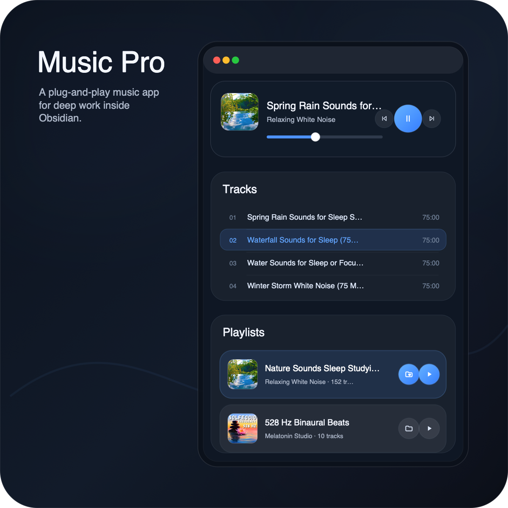
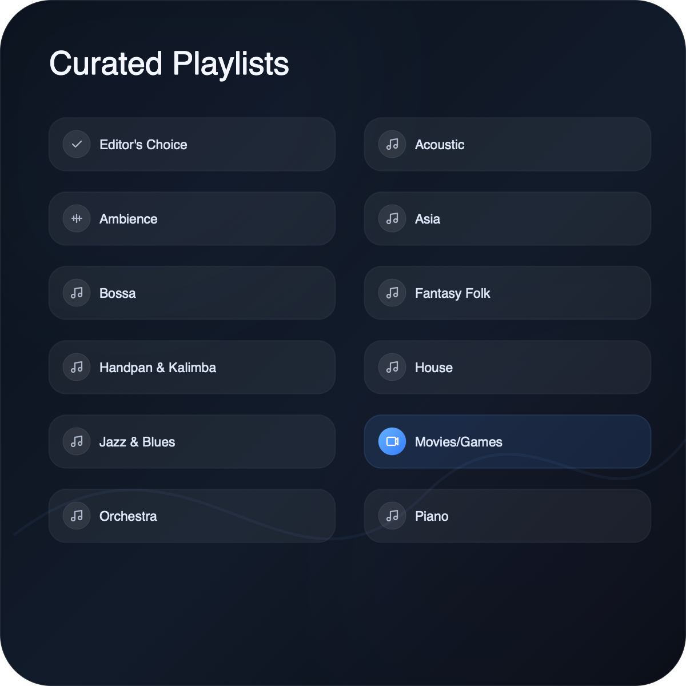
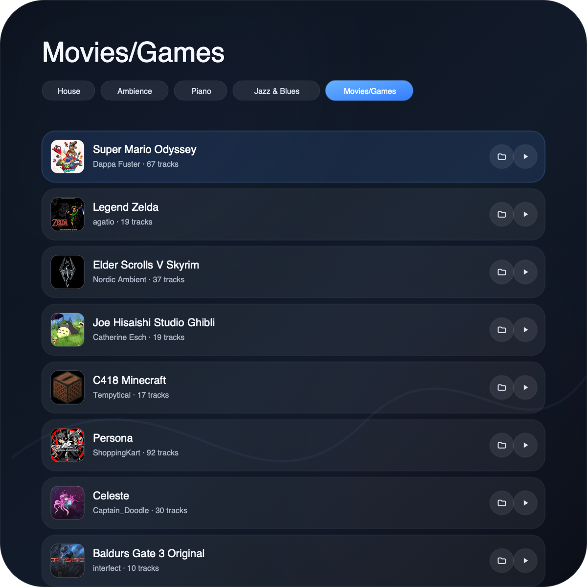
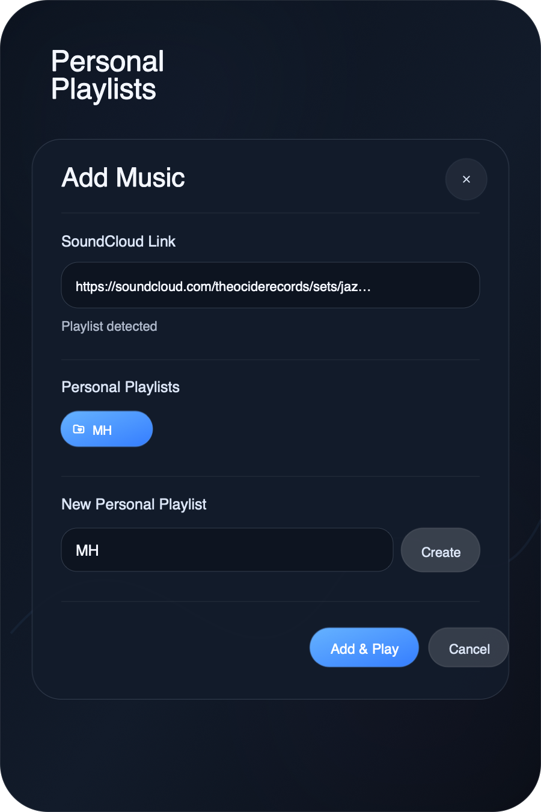
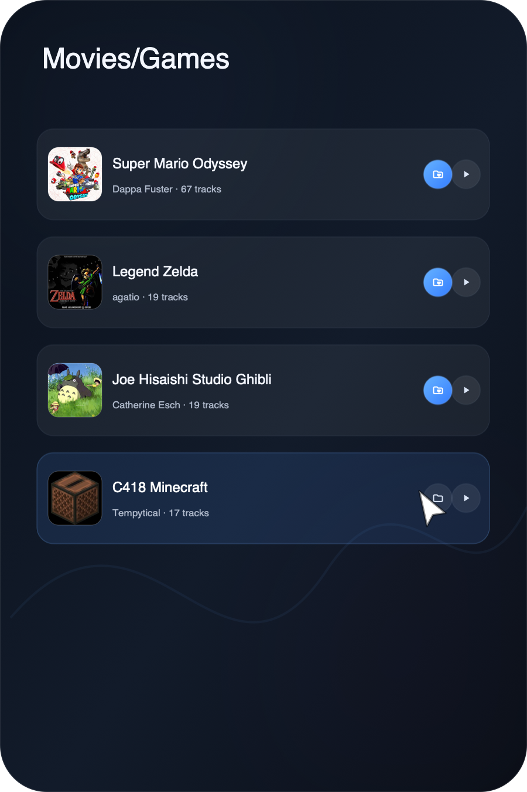
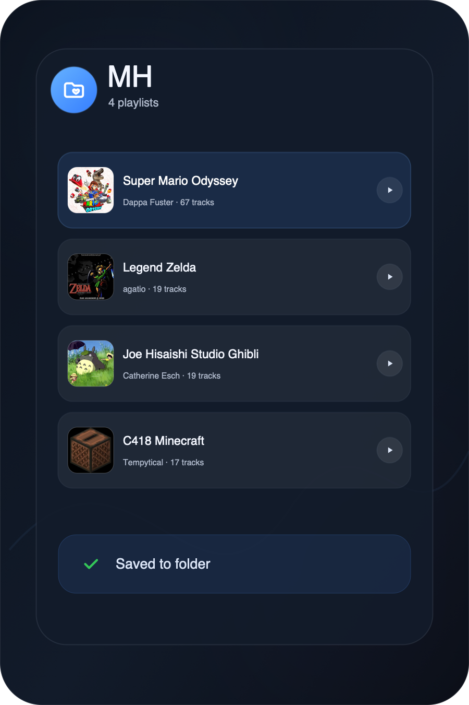
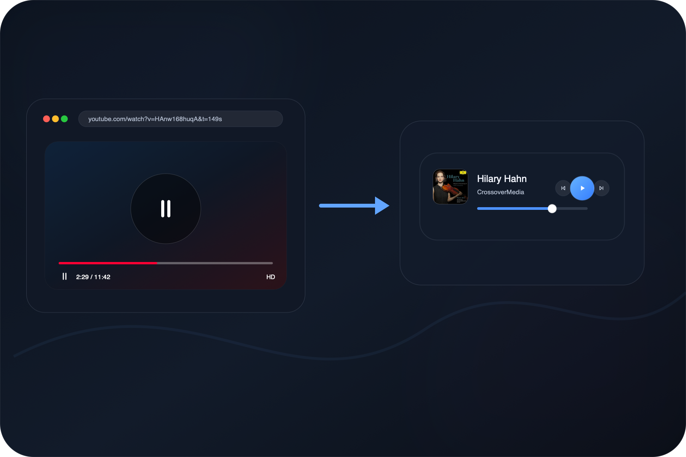
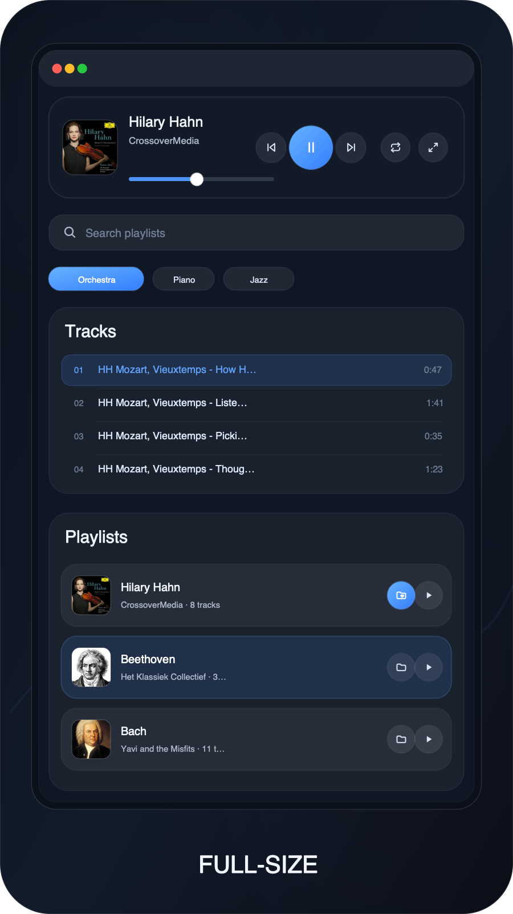
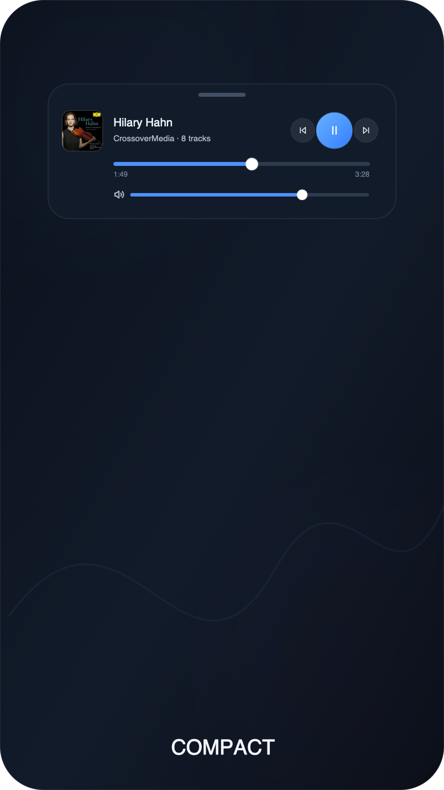
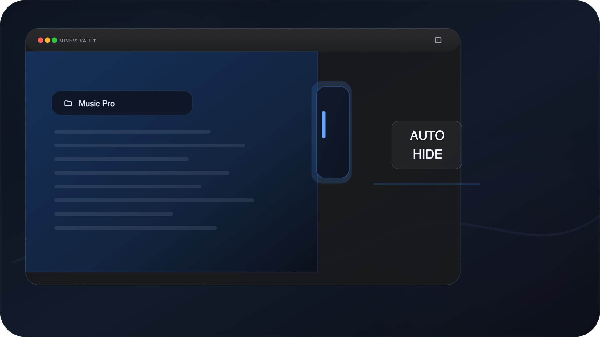

# Music Pro

A plug-and-play music app for deep work inside Obsidian.

## Why Music Pro?
- No ads.
- No complex setup.
- Curated playlists specifically for work, study, reading, and deep focus.
- Clean & Modern UI.
- Lightweight:
	- No MP3 files stored in your vault.
	- Music comes from public SoundCloud playlists.
		- Music loads only when needed.
		- Music consumes much less network data than music video. => Maybe wanna work outside? Not a problem!

## Features
### Curated Playlists

Music comes from public SoundCloud playlists. Music Pro organizes them into focused playlists for work, study, reading, ambience, piano, orchestra, jazz, games, and more.

  
  

### Personal Playlists

Add your own SoundCloud tracks, playlists, albums. **Create and manage personal playlist** folders, from saving your favorite tracks to renaming, deleting, and reordering folder structure. You could even **turn off** the list that you are not the fan of.

  
  
  

### Auto-pause For Other Audio

When a website, webview, audio, or video inside Obsidian starts playing, Music Pro **pauses automatically**. When that audio stops, Music Pro **automatically resumes** the music.

### Full-size And Compact

Use **full-size mode** when you want the complete app: player, tracks, playlists, search, and folders. Use **compact mode** when you want small controls nearby; it can auto-hide and tuck into the sidebar when you do not need it.

  
  

  

## Installation
Install Music Pro from inside Obsidian:

1. Open **Settings → Community plugins**.
2. Search for **Music Pro**.
3. Click **Install**, then **Enable**.
4. Open Music Pro from the ribbon icon or run **Music Pro: Open**.

## Commands
In Obsidian's command palette, search for **Music Pro** and run:

- Music Pro: Open
- Music Pro: Shutdown
- Music Pro: Play/Pause
- Music Pro: Next Track
- Music Pro: Previous Track
- Music Pro: Compact/Fullsize
- Music Pro: Volume 0%
- Music Pro: Volume 30%
- Music Pro: Volume 60%
- Music Pro: Volume 90%

## Privacy and Network Use
Music Pro has no telemetry, analytics, ads, or account requirement.

It only connects to:

- SoundCloud, to play music and load public playlist info.
- Your remote catalog URL, only if you enable remote catalog refresh.

Saved locally in Obsidian:

- Your personal playlists and SoundCloud links.
- Playback, recent items, order, ranking, and UI preferences.
- Cached catalog data, if remote catalog refresh is enabled.

Music Pro is not affiliated with SoundCloud or Obsidian.

## Future Roadmap
Music Pro is not a one-and-done project. I keep an eye on bugs, playback issues, and playlist quality. Constantly, I check the playlists, remove weak or broken picks, keep the good ones, and add fresh music.

If Music Pro helps your workflow, consider supporting the work: [Support on Ko-fi](https://ko-fi.com/minhhoang2000).

## Feedback
Found a bug or have an idea? [Send feedback on Ko-fi](https://ko-fi.com/minhhoang2000).

## License
Music Pro is released under the [GNU General Public License v3.0 only](./LICENSE) (`GPL-3.0-only`). Copyright © 2026 Minh Hoang.
