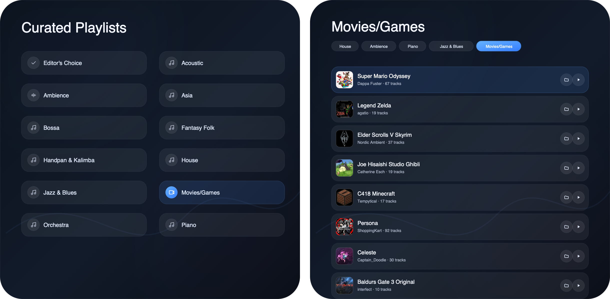
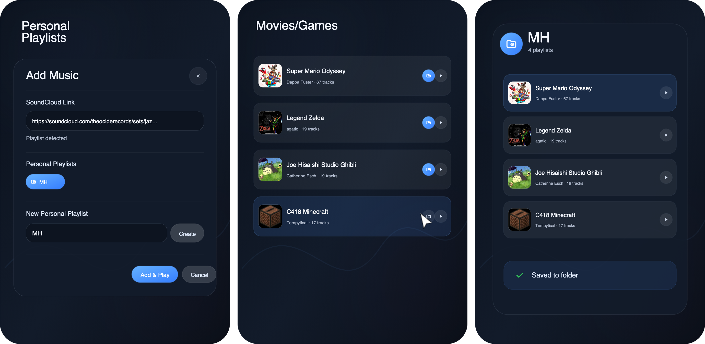
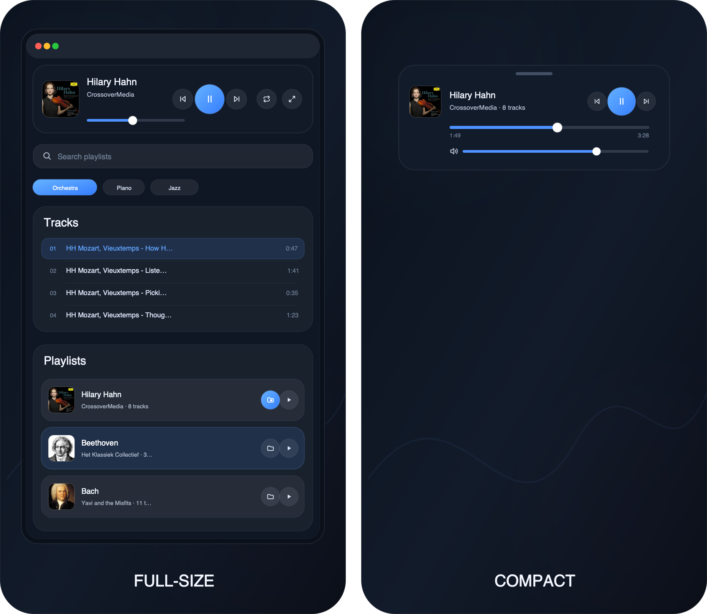

# Music Pro

A plug-and-play music app for deep work inside Obsidian.

Music Pro gives you focused playlists, a clean player, and a compact mini mode without complicated setup. Install it, enable it, and press play.

## Why Music Pro?

- Free to use.
- No ads.
- No complex setup.
- Uses little network data, so you can easily listen while working from a cafe, park, or on the go.
- Curated playlists for work, study, reading, and deep focus.
- Lightweight: no MP3s or audio files are stored in your vault.
- Clean and easy to use.

## Features

### Curated Playlists

Browse real SoundCloud playlists organized for focus, ambience, piano, orchestra, jazz, games, and more.

### Personal Playlists

Save your own SoundCloud links into personal folders, then rename, reorder, or clean them up anytime.

### Auto-pause For Other Audio

When another website, webview, audio, or video inside Obsidian starts playing, Music Pro can pause automatically and resume when that audio stops.

### Full-size And Compact

Use full-size mode for browsing playlists and tracks. Use compact mode when you only need quick controls nearby.

## Installation

Install Music Pro from inside Obsidian:

1. Open **Settings → Community plugins**.
2. Search for **Music Pro**.
3. Click **Install**, then **Enable**.
4. Open Music Pro from the ribbon icon or run **Music Pro: Open**.

## Commands

In Obsidian's command palette, search for **Music Pro** and run:

- Music Pro: Open
- Music Pro: Shutdown
- Music Pro: Play/Pause
- Music Pro: Next Track
- Music Pro: Previous Track
- Music Pro: Compact/Fullsize
- Music Pro: Volume 0%
- Music Pro: Volume 30%
- Music Pro: Volume 60%
- Music Pro: Volume 90%

## Privacy and Network Use

Music Pro has no telemetry, analytics, ads, or account requirement. It does not send your listening data or personal information anywhere.

It only connects to:

- SoundCloud, to play music and load public playlist info.

Saved locally in Obsidian:

- Your saved links, personal playlists, preferences, and recent plays.
- Playback, recent items, order, ranking, and UI preferences.
- Local listening behavior used only inside Music Pro, such as approximate listen time and play/completion/skip counts.
- Cached catalog data so the playlist library opens quickly between refreshes.

No MP3s or audio files are stored in your vault.

Music Pro is not affiliated with SoundCloud or Obsidian.

## Future Roadmap

Music Pro is an ongoing project, not a one-time release. I keep an eye on bugs, playback issues, and playlist quality. I regularly review playlist performance, remove weak or broken picks, keep the good ones, and add fresh music.

If Music Pro helps your workflow, consider supporting the work: [Support on Ko-fi](https://ko-fi.com/minhhoang2000).

## Feedback

Found a bug or have an idea? [Send feedback on Ko-fi](https://ko-fi.com/minhhoang2000).

## License

Music Pro is released under the [GNU General Public License v3.0 only](./LICENSE) (`GPL-3.0-only`). Copyright © 2026 Minh Hoang.
